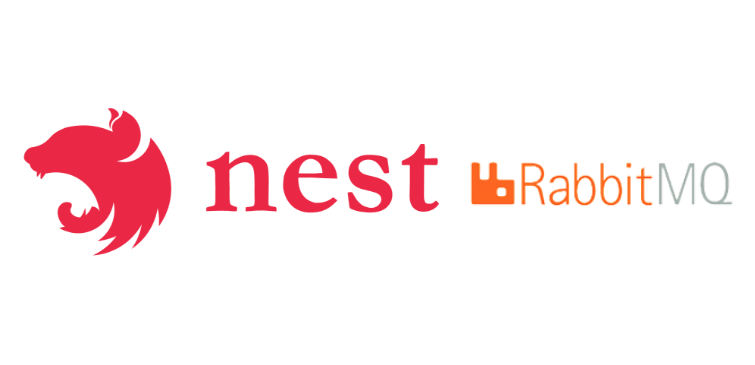

# NestJS Microservices Example

  <a href="#-projeto">Projeto</a>&nbsp;&nbsp;&nbsp;|&nbsp;&nbsp;&nbsp;
  <a href="#-tecnologias">Tecnologias</a>&nbsp;&nbsp;&nbsp;|&nbsp;&nbsp;&nbsp;
  <a href="#-como-executar">Como executar</a>&nbsp;&nbsp;&nbsp;|&nbsp;&nbsp;&nbsp;
  <a href="#-licença">Licença</a>

 

  

## 💻 Projeto

Este projeto visa a sintetização e construção de uma arquitetura de microserviços. A estrutura principal é desenvolvida utilizando o poderoso framework NestJS, conhecido por sua capacidade de criar aplicativos robustos e facilmente escaláveis, garantindo assim a confiabilidade e a manutenção simplificada. A integração do RabbitMQ como sistema de mensageria proporciona uma comunicação assíncrona eficaz entre os serviços, garantindo a distribuição inteligente de tarefas e o processamento eficiente de mensagens, mesmo em ambientes complexos e distribuídos. O uso dessas tecnologias combinadas oferece não apenas uma arquitetura flexível, mas também possibilita a construção de sistemas altamente distribuídos e resilientes, preparados para enfrentar desafios contemporâneos de escalabilidade e robustez.

## ✨ Tecnologias

Esse projeto foi desenvolvido com as seguintes tecnologias:

- [NodeJS](https://nodejs.org)
- [Typescript](https://www.typescriptlang.org)
- [NestJS](https://nestjs.com)
- [RabbitMQ](https://www.rabbitmq.com/)

## 🚀 Como executar

- Clone o repositório
- Certifique-se de ter o Docker instalado em sua máquina.
- Crie e execute os containers Docker utilizando `docker-compose up`
- Aguarde a criação dos containers e a instalação das dependências

Agora você pode acessar as rotas em [`localhost:9092`](http://localhost:9092) e [`localhost:9093`](http://localhost:9093) utilizando o [Postman](https://www.postman.com/) ou [Insomnia](https://insomnia.rest/)

## 📄 Licença

Esse projeto está sob a licença MIT. Veja o arquivo [LICENSE](LICENSE) para mais detalhes.

---

Feito com ♥ por Erick Nathan.
